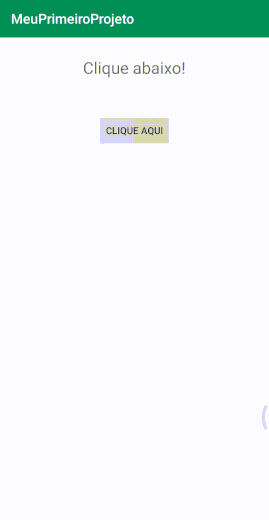

# Desenvolvimento Android #01
   * ***Objetivo:*** utilizar os componentes visuais TextView e Button, como recuperar e editar o conteúdo de uma caixa de texto atribuindo um evento ao clique do botão.

