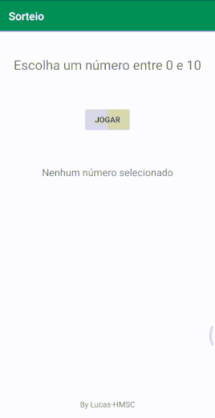

# Desenvolvimento Android #02
   * ***Objetivo:*** avançar conhecimentos com eventos de clique, utilização da classe Random para gerar números aleatórios.
   * Veja abaixo uma demonstração da aplicação:

