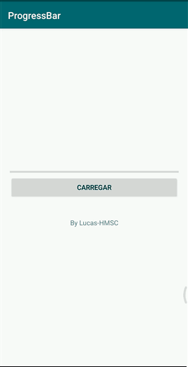

# Desenvolvimento Android #12
   * ***Objetivo:*** utilizar uma ProgressBar para implementar métodos que alteram seu valor de acordo com o clique de um Button.
   * Veja abaixo uma demonstração da aplicação:

