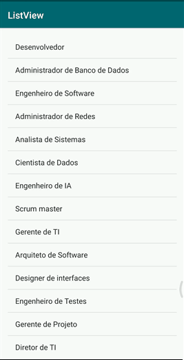

# Desenvolvimento Android #14
   * ***Objetivo:*** criar e implementar uma ListView, que contém varias opções de TextView no Linear Layout, e utilizar métodos que são acionados quando uma dessas opções são pressionadas, exibindo um Toast com o valor recuperado dessa opção.
   * Veja abaixo uma demonstração da aplicação:

