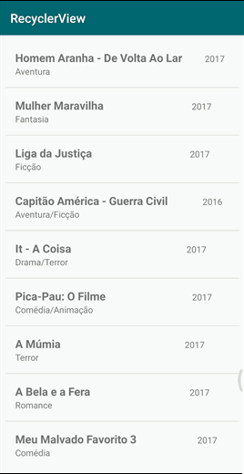

# Desenvolvimento Android #15
    * ***Objetivo:*** utilizar um RecyclerView, uma opção mais avançada para exibição de listas que economiza memória exibindo somente as opções que couberem na tela do usuário, e utilizando métodos para clique e pressionamento longo das opções individualmente.
    * Veja abaixo uma demonstração da aplicação:

