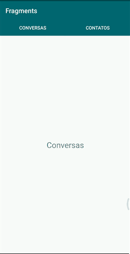

# Desenvolvimento Android #19
   * ***Objetivo:*** criar e implementar Fragments, para exibição de conteúdos diferentes na mesma tela, separados por Abas por exemplo, independetes entre si e com layouts personalizados.
   * Veja abaixo uma demonstração da aplicação:

