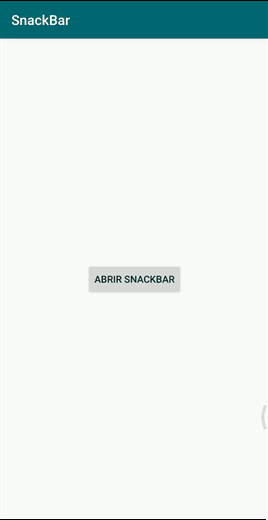

# Desenvolvimento Android #20
    * ***Objetivo:*** criar e implementar uma das formas disponíveis de notificações, sendo esta localizada na parte inferior da tela com uma opção clicavel que pode ser personalizada.
    * Veja abaixo uma demonstração da aplicação:

