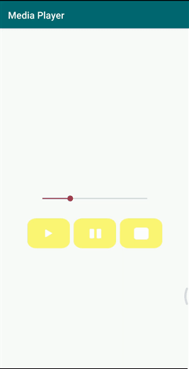

# Desenvolvimento Android #24
   * ***Objetivo:*** introdução ao uso de reprodutores de mídias sonoras, implementando métodos de Play, Pause e Stop, assim como uma SeekBar com acesso direto ao controle de som do dispositivo do usuário.
   * Veja abaixo uma demonstração da aplicação:

