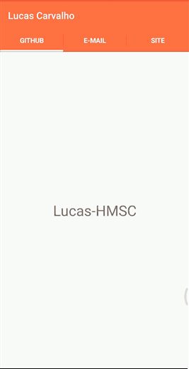

# Desenvolvimento Android #26
    * ***Objetivo:*** criar e implementar Abas dentro de uma Activity, para cada uma direcionado a um Fragment com conteúdos personalizados.
    * Veja abaixo uma demonstração da aplicação:

